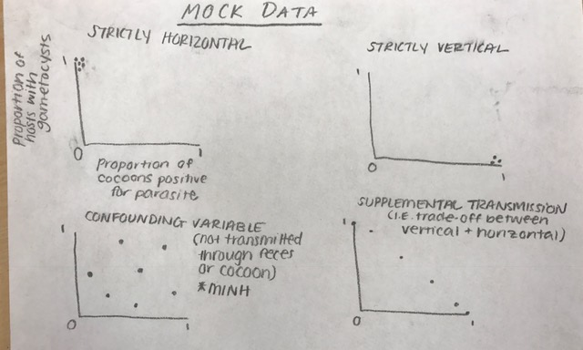
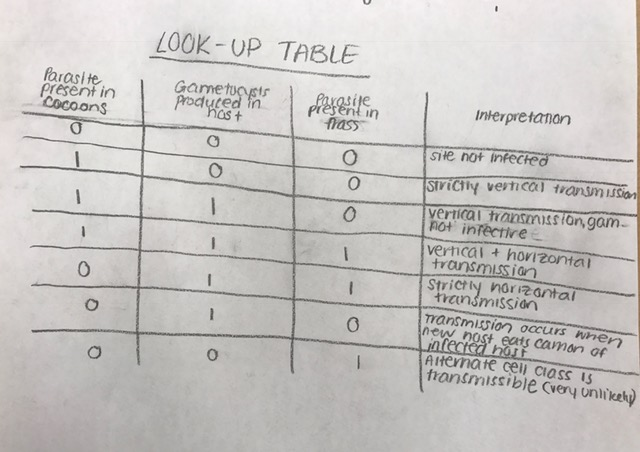

# Assignment 2   

These are the tools I have used to structure my experimental design and hypotheses.

## Mock Data   

*This method provides me with an idea of what different results would look like.*   

## Look Up Tree   

*This method allows me to come up with interpretations based on the presence or absense of three variables.*   

## Path Diagram

*This method allows me to picture all of the different interactions between variabels that may lead to a particular outcome.*

## Logic Tree

*This method allows me to step through my experimental design and see what conclusions I can make based off of my observations.*
