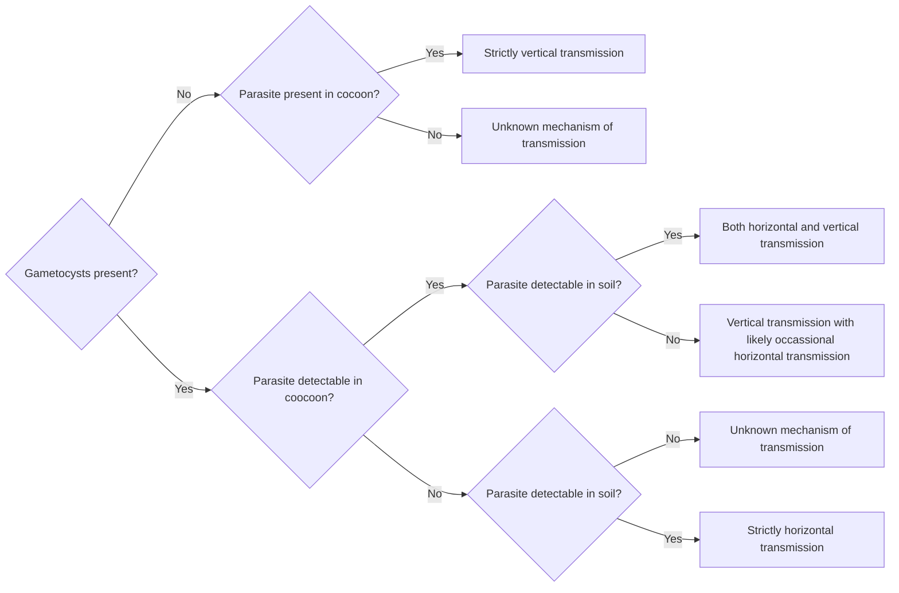

```mermaid
graph LR
A{Gametocysts present?} 
	A -->|Yes| C
	A -->|No| B
    B{Parasite present in cocoon?}
    B -->|Yes| D
    B -->|No| E
    D[Strictly vertical transmission]
    E[Unknown mechanism of transmission]
    C{Parasite detectable in coocoon?}
    C -->|Yes| F
    C -->|No| G
    F{Parasite detectable in soil?}
    G{Parasite detectable in soil?}
    F -->|Yes| J
    F -->|No| K
    G -->|No| H
    G -->|Yes| I
    H[Unknown mechanism of transmission]
    I[Strictly horizontal transmission]
    J[Both horizontal and vertical transmission]
    K[Vertical transmission with likely occassional horizontal transmission]
    
 
```